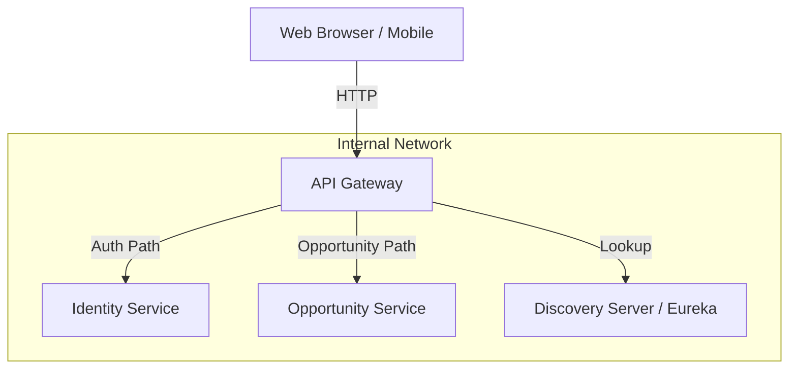

# System Context: API Gateway

The **TechConnect API Gateway** is the single entry point for all client applications (like the TechConnect Web App) to access backend microservices.

## Architectural Role

The gateway acts as a reverse proxy, routing incoming HTTP requests to the appropriate downstream service based on the URL path. It also provides a centralized security layer via JWT validation.

## Internal & External Flow

1. **Client Request**: A client sends a request to `http://localhost:8080/api/v1/...`.
2. **Security**: The `JwtAuthFilter` intercepts the request and validates the `Authorization: Bearer <token>` header (unless it's an auth-related path).
3. **Service Discovery**: For specific routes (like `/api/v1/opportunities/**`), the gateway uses Eureka to find a live instance of the `opportunity-service`.
4. **Routing**: The gateway forwards the request to the target service.
5. **Response**: The downstream response is passed back to the client.

## Integration Dependencies

- **Eureka (Discovery Server)**: The gateway must register with and fetch the registry from Eureka to route traffic using service names (`lb://`).
- **Identity Service**: Used for authentication and token generation (referenced in routes).
- **Opportunity Service**: The primary domain service for managing data.
